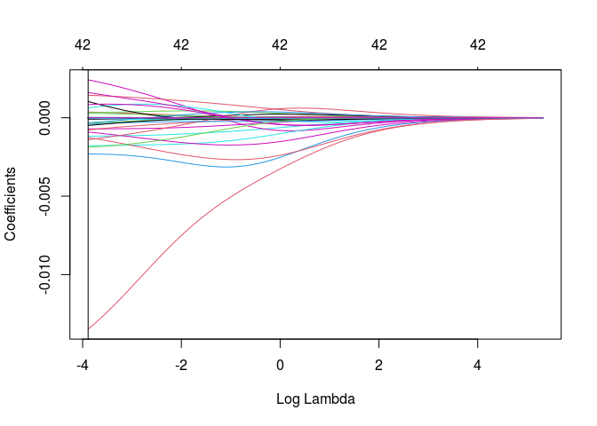
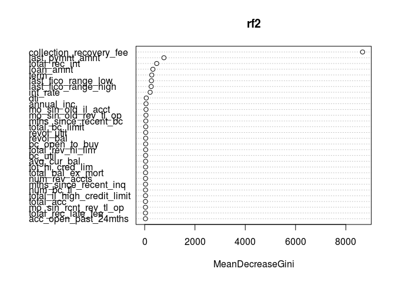

Stat 652 Semester Project: Lending Club Challenge Report
================
Michael Najarro
3/16/2020

# *Abstract*

The goal of this project is to predict whether a borrower will be at
risk to default on his or her loan. Here I classify lending club members
based on the response variable loan status. After refining the initial
data performing and tuning a random forest classification model, I was
able classify the likelihood of a banking client defaulting as being a
risk or safe lend with Accuracy of 97.71% (95% CI: (0.9746, 0.9795)),
Sensitivity 0f 89.21% and Specificity of 99.46%. The variables with
greatest contribution to classification was the value of colelction
recovery fees and last payment amount

# *Introduction*

Lending Club is a peer-to-peer lending company where Lending club
facilitates the borrowing and leasing of capital amongst its clients,
with minimal fees. This financial system allows for local economies to
grow by allowing its members to fund its members privately and also gain
from such investments.

The Lending club data used was posted on 2018 as part of a Kaggle
competition to evalaute the likelihood of whether a borrower would be at
risk or not at risk for defaulting on a micro loan. Originally the data
set contained infromation on borrowers from 2007 up to 2018 (roughly 2
million rows). The goal of this project was to classify whether borrower
defaulted or did not default on his or her loan, for a small subset of
the years offered, from 2012 to 2014, and for the variable Loan Stauts

# *Methods*

## Importing the lending club data to the R environment

Due to the limitations in computing power of my local machine, I was
able to obtain a 10% portion of the of the 2012-2014 Lending club data;
I applied a stratified random sample to the 3 years of the issue\_d
column and extracted those rows from the main data set.

The response variable,Loan Status, was a factor variable contain 6
levels on the condition of the loan: “Fully paid”, “Does not meet the
credit policy. Status:Fully Paid”, “In Grace Period”, “Late (16-30
days)”, “Late (31-120 days)”, “Charged Off”, “Default”, “Does not meet
the credit policy. Status:Charged Off.”

For the sake of classification I combined “Fully paid” and “Does not
meet the credit policy. Status:Fully Paid” Into one classifier called
“safe,” and all other levels into another classifier called “risk.”

From there, I then applied a random stratified sample to each year of
2012 through 2014 such that the total sample collected represented 20%
of the 2012-2014 years. The procedures for collecting this data can be
found in a seperate Rmarkdown file titled “LC\_data\_cleaning.Rmd.”

## Munging the data

I used several approaches to clean the data:

1.  I removed any personal identifying variables (two existed)

2.  I removed all rows whose response variable had a value of NA.

3.  I removed all predictor variables that contained 50% more of its
    measures as NA.

4.  I then took a detailed look at factor and numeric variables:

<!-- -->

1.  for factor variables, any variables that were cateogircal measures
    of another numeric variable column, had many levels, and ahd an
    uneven spread of data amongst its levels I removed.

2.  for numeric variables, Any variables that contained low variance,
    highly skewed distributions, and/or had high correlations, I removed

<!-- -->

5.  For remaining Nas, I imputed the median value for numeric variables,
    and then removed Nas for factor variables.

The remaining predictor variables are presented below, as well the
remaining data used to perform the classification. Note that the
variable “chance default” is the response variable and that there were
no remaining NAs within the data.

| variables                      |
|:-------------------------------|
| loan\_amnt                     |
| term                           |
| int\_rate                      |
| home\_ownership                |
| annual\_inc                    |
| Issue\_Year                    |
| dti                            |
| delinq\_2yrs                   |
| revol\_bal                     |
| revol\_util                    |
| total\_acc                     |
| initial\_list\_status          |
| total\_rec\_int                |
| total\_rec\_late\_fee          |
| collection\_recovery\_fee      |
| last\_pymnt\_amnt              |
| last\_fico\_range\_high        |
| last\_fico\_range\_low         |
| tot\_cur\_bal                  |
| total\_rev\_hi\_lim            |
| acc\_open\_past\_24mths        |
| avg\_cur\_bal                  |
| bc\_open\_to\_buy              |
| bc\_util                       |
| mo\_sin\_old\_il\_acct         |
| mo\_sin\_old\_rev\_tl\_op      |
| mo\_sin\_rcnt\_rev\_tl\_op     |
| mo\_sin\_rcnt\_tl              |
| mort\_acc                      |
| mths\_since\_recent\_bc        |
| mths\_since\_recent\_inq       |
| num\_actv\_bc\_tl              |
| num\_actv\_rev\_tl             |
| num\_bc\_sats                  |
| num\_bc\_tl                    |
| num\_il\_tl                    |
| num\_op\_rev\_tl               |
| num\_rev\_accts                |
| num\_rev\_tl\_bal\_gt\_0       |
| num\_sats                      |
| num\_tl\_op\_past\_12m         |
| pct\_tl\_nvr\_dlq              |
| tot\_hi\_cred\_lim             |
| total\_bal\_ex\_mort           |
| total\_bc\_limit               |
| total\_il\_high\_credit\_limit |
| chance\_default                |

Variables names of the refined lending club data

|  rows | columns |
|------:|--------:|
| 59267 |      47 |

Dimensions of refined lending club data

## Analysis and results

To evaluate whether I could remove more variables I applied LASSO
regression analysis for further variable selection. Surprisiingly the
analysis indicated not to exlude all variables despite their near zero
value

    ## [1] 0.0204821

<!-- -->

    ## 44 x 1 sparse Matrix of class "dgCMatrix"
    ##                                        1
    ## (Intercept)                 4.696079e+00
    ## (Intercept)                 .           
    ## loan_amnt                  -1.160878e-05
    ## int_rate                   -1.347627e-02
    ## annual_inc                  1.225477e-07
    ## Issue_Year                 -2.305606e-03
    ## dti                        -1.174941e-03
    ## delinq_2yrs                 2.419661e-03
    ## revol_bal                   2.029442e-07
    ## revol_util                  3.677105e-04
    ## total_acc                   2.265215e-05
    ## total_rec_int               2.197494e-05
    ## total_rec_late_fee         -1.781446e-03
    ## collection_recovery_fee    -7.050846e-04
    ## last_pymnt_amnt             1.615489e-05
    ## last_fico_range_high        1.437923e-03
    ## last_fico_range_low         3.186185e-04
    ## tot_cur_bal                 7.591140e-09
    ## total_rev_hi_lim           -1.916439e-07
    ## acc_open_past_24mths       -9.130129e-04
    ## avg_cur_bal                -2.549100e-07
    ## bc_open_to_buy             -4.576650e-07
    ## bc_util                     2.863547e-04
    ## mo_sin_old_il_acct         -5.352402e-05
    ## mo_sin_old_rev_tl_op       -3.298199e-05
    ## mo_sin_rcnt_rev_tl_op      -4.844483e-05
    ## mo_sin_rcnt_tl             -8.848765e-05
    ## mort_acc                   -1.399094e-03
    ## mths_since_recent_bc        1.465552e-05
    ## mths_since_recent_inq      -3.159224e-04
    ## num_actv_bc_tl              6.358996e-04
    ## num_actv_rev_tl             1.610527e-03
    ## num_bc_sats                 1.039005e-03
    ## num_bc_tl                  -7.807824e-04
    ## num_il_tl                  -3.663472e-04
    ## num_op_rev_tl              -4.113586e-04
    ## num_rev_accts              -1.276247e-05
    ## num_rev_tl_bal_gt_0         8.446981e-04
    ## num_sats                   -4.913342e-04
    ## num_tl_op_past_12m         -1.263125e-03
    ## pct_tl_nvr_dlq             -1.877767e-03
    ## tot_hi_cred_lim             2.502261e-08
    ## total_bal_ex_mort           1.905688e-08
    ## total_il_high_credit_limit  1.626692e-07

    ## [1] 43

I performed a random forest classification algorithm on the remaining
data, which I split into test and training data. I used all predictors
and then used the model to predict loan status outcomes on the test
data.

Using Caret to tune my model, I modified the model to have 325 trees and
set mtry equal to 46. Results below indicate the ouput of the Random
forest confusion matrix:

### **Confusion Matrix and Statistics**

Reference Prediction risk safe risk 2249 67 safe 272 12229

Accuracy : 0.9771  
95% CI : (0.9746, 0.9795) No Information Rate : 0.8299  
P-Value \[Acc &gt; NIR\] : &lt; 2.2e-16

Kappa : 0.9163

Mcnemar’s Test P-Value : &lt; 2.2e-16

Sensitivity : 0.8921  
Specificity : 0.9946  
Pos Pred Value : 0.9711  
Neg Pred Value : 0.9782  
Prevalence : 0.1701  
Detection Rate : 0.1518  
Detection Prevalence : 0.1563

# *Conclusion*

The reduction in data greatly increased the predictive power of the
model. Specificity was quite accurate at 99%, while sensitivity was at
89%; accuracy was quite high at 98%. the False negative rate was at
.45%. Part of the specificty’s low value was due to an uneven balance in
the number of risky to safe outcomes on defaulting loans even after
combining levels of loan status. Further, a majority of the variables
kept in the model were all equally poor in contributing to the
classification of loan status based on the Lasso regresison analysis and
the contribution of each predictor variable in purity at each node split
(gini-index, see figure below).

    ## randomForest 4.6-14

    ## Type rfNews() to see new features/changes/bug fixes.

    ## 
    ## Attaching package: 'randomForest'

    ## The following object is masked from 'package:dplyr':
    ## 
    ##     combine

    ## The following object is masked from 'package:ggplot2':
    ## 
    ##     margin

<!-- -->

We see that collection recovery fee, last payment amount and total
recieved interest (to lender) contributed greatly to average Gini index
per tree if the variable was excluded, indicating high importance to
classification to defaulting.

Overall, I find that the great majority of observational data is not of
importance to classification, and only a few variables were ableto help
create an ensemble consensus for predicting loan default status.
